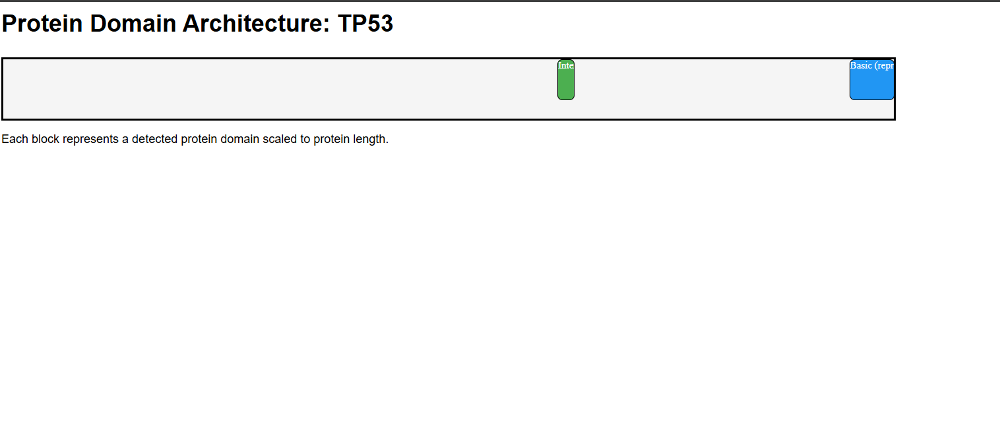

# Gene Analysis Pipeline using Snakemake

## Overview
This project implements an end-to-end bioinformatics pipeline for gene analysis using Snakemake. It retrieves gene sequences, computes GC content, identifies open reading frames (ORFs), extracts protein domain information, and visualizes domain architecture.

---

## Features
- Gene sequence retrieval from UniProt API  
- GC content calculation  
- ORF detection  
- Protein domain extraction  
- Domain architecture visualization (HTML output)  
- Modular and reproducible workflow using Snakemake  

---

## Workflow
1. Fetch gene sequence  
2. Compute GC content  
3. Identify ORFs  
4. Retrieve protein domains  
5. Generate summary report  
6. Visualize protein domain architecture  

---

## Example Output

### Protein Domain Visualization


---

## How to Run

### Requirements
- Python 3.x  
- Snakemake  

### Run the pipeline

```bash
snakemake -j 1 --config gene=TP53 organism_id=9606
```

---

## Output Structure

```plaintext
results/
└── TP53/
    ├── domains.csv
    ├── domain_plot.html
    ├── gc.txt
    ├── orfs.csv
    └── summary.csv
```

---

## Technologies Used
- Snakemake  
- Python  
- REST APIs (UniProt)  

---

## Future Improvements
- Add web interface for user input  
- Support batch processing of multiple genes  
- Improve visualization (interactive plots)  

---

## Author
Amogh Palasamudram
